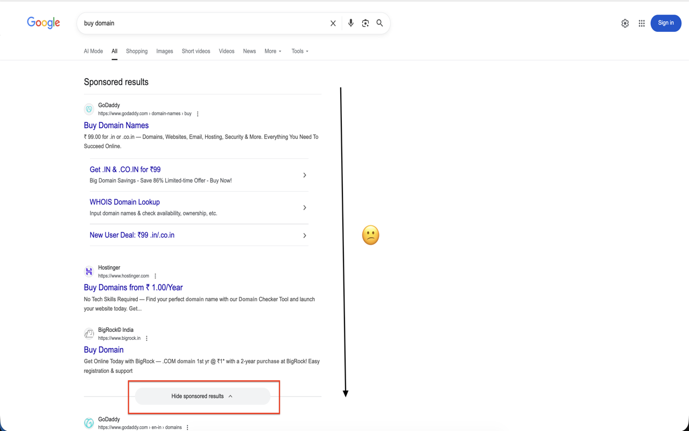

# Hide Sponsored Results for Google Search

A tiny Chrome/Edge extension that auto-clicks the "Hide sponsored results" control on Google Search so ads collapse and the organic list stays in view.

## Why it exists

- Cuts down distractions and misleading sponsored results when searching.
- Saves the extra click every time Google reloads or injects new ads.

## Tech

- React + TypeScript + Vite popup UI, styled with Tailwind utility classes.
- Manifest V3 content script that watches DOM mutations and clicks the stored selector/text (saved in `chrome.storage.sync`).
- Build output in `dist/` is ready to load as an unpacked extension.

## Setup

1. Install deps: `npm install`
2. Build extension: `npm run build` (outputs to `dist/`)
3. Load unpacked in Chrome/Edge: `dist/`
4. In the popup, set the selector/text if you want to override the defaults for the hide control.

## Store links

- Chrome Web Store: _Coming soon_
- Microsoft Edge Add-ons: _Coming soon_

## Screenshots

